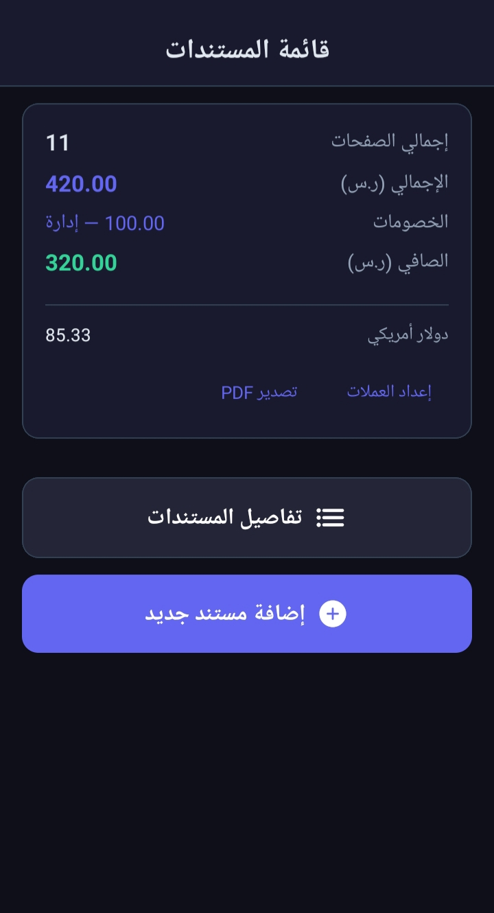
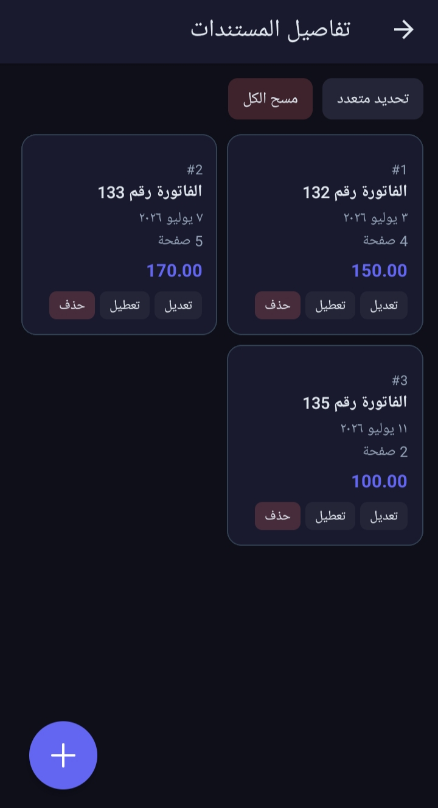
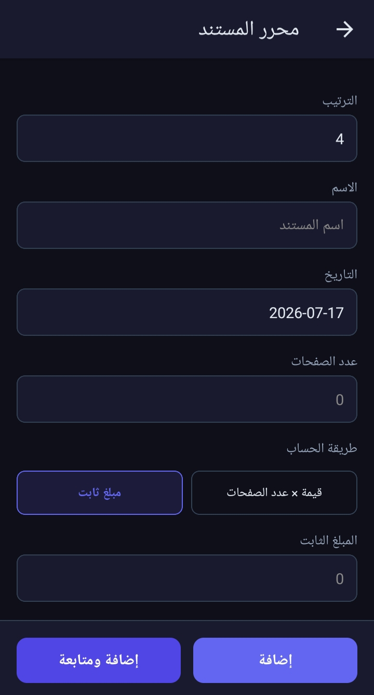
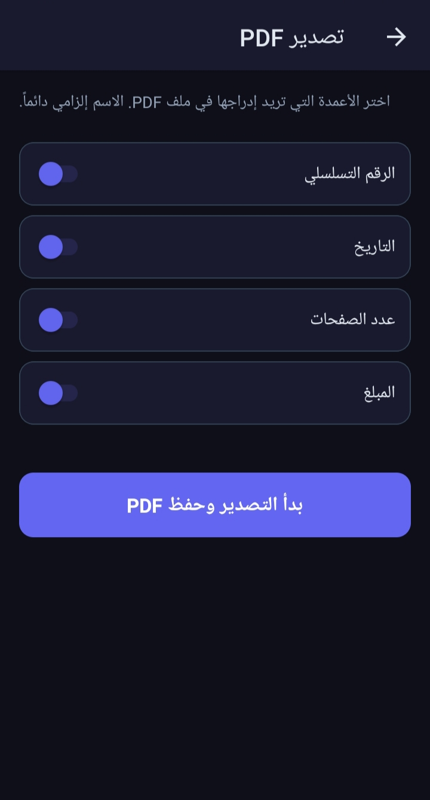

<p align="center">
  <picture>
    <source media="(prefers-color-scheme: dark)" srcset="./assets/images/favicon.png">
    <source media="(prefers-color-scheme: light)" srcset="./assets/images/favicon.png">
    
  </picture>
</p>

<h1 align="center">قائمة المستندات — Documents List</h1>

<p align="center">
  <strong>مدير مستندات مالية يعمل بدون اتصال، مع دعم العملات المتعددة وتتبع الخصومات وتصدير PDF — مصمم لسير العمل العربي (RTL).</strong>
</p>

<p align="center">
  <em>Offline-first financial document manager with multi-currency support, deduction tracking, and PDF export — built for Arabic (RTL) workflows.</em>
</p>

<br />

<p align="center">
  <a href="./LICENSE"></a>
  <a href="#"></a>
  <a href="#"></a>
</p>

<p align="center">
  <a href="#"></a>
  <a href="#"></a>
  <a href="#"></a>
  <a href="#"></a>
</p>

<br />

## 📑 Table of Contents

- [✨ Why Documents List](#-why-documents-list)
- [🚀 Key Features](#-key-features)
- [🖼️ Screenshots](#️-screenshots)
- [🛠️ Tech Stack](#️-tech-stack)
- [🏗️ Architecture](#️-architecture)
- [📁 Project Structure](#-project-structure)
- [⚡ Quick Start](#-quick-start)
- [⚙️ Configuration](#️-configuration)
- [📦 Building & Deployment](#-building--deployment)
- [🤝 Contributing](#-contributing)
- [📄 License](#-license)

---

## ✨ Why Documents List

<table>
<tr>
<td width="33%" align="center">

### 🔒 Offline-First

All data persists locally via **AsyncStorage**.<br />
No backend. No sign-up. No network required.

</td>
<td width="33%" align="center">

### 🌐 Arabic RTL First

Full right-to-left layout, Arabic labels,<br />
and `ar-EG` date formatting out of the box.

</td>
<td width="33%" align="center">

### 💰 Financial Tracking

Multi-currency conversion, deduction<br />
management, and PDF export in one place.

</td>
</tr>
</table>

> **Built for Arabic-speaking freelancers and small businesses** who need a simple, fast, and reliable way to manage financial documents — entirely offline, with professional PDF output.

---

## 🚀 Key Features

<table>
<thead>
<tr>
<th width="20%">Category</th>
<th width="25%">Feature</th>
<th>Description</th>
</tr>
</thead>
<tbody>

<tr><td colspan="3"><strong>📋 Data Management</strong></td></tr>
<tr><td></td><td>Multiple Views</td><td>Switch between list, card, and 2-column grid layouts</td></tr>
<tr><td></td><td>Document Editor</td><td>Title, date, amount, notes, and calculation mode (multiply / fixed)</td></tr>
<tr><td></td><td>Batch Operations</td><td>Multi-select to delete or toggle documents in bulk</td></tr>
<tr><td></td><td>Smart Ordering</td><td>Insert documents at any position; auto-reindex on every mutation</td></tr>

<tr><td colspan="3"><strong>💳 Financial Tools</strong></td></tr>
<tr><td></td><td>Multi-Currency</td><td>Configurable primary currency + unlimited additional currencies with conversion rates</td></tr>
<tr><td></td><td>Deductions</td><td>Add, edit, and delete deduction amounts subtracted from gross totals</td></tr>
<tr><td></td><td>Calculation Modes</td><td>Per-document: <code>multiply</code> (value × pages) or <code>fixed</code> (flat amount)</td></tr>
<tr><td></td><td>Summary Dashboard</td><td>Real-time totals for pages, amounts, deductions, and net</td></tr>

<tr><td colspan="3"><strong>📤 Export</strong></td></tr>
<tr><td></td><td>PDF Export</td><td>Generate a styled HTML-to-PDF table with togglable columns (serial, date, pages, amount). Uses SAF on Android and share sheet on iOS.</td></tr>

<tr><td colspan="3"><strong>🎨 User Experience</strong></td></tr>
<tr><td></td><td>Dark Theme</td><td>Deep indigo dark theme (<code>#0f0f1a</code>) with customizable accent color</td></tr>
<tr><td></td><td>RTL Layout</td><td>Mirrored navigation, right-aligned text, Arabic numerals</td></tr>
<tr><td></td><td>Animated Feedback</td><td>Slide-down validation banners and haptic feedback</td></tr>
<tr><td></td><td>Quick Entry</td><td>"Add and Continue" flow for rapid sequential document entry</td></tr>

</tbody>
</table>

---

## 🖼️ Screenshots

|                  Home Screen                  |                  Documents Details                  |
| :-------------------------------------------: | :-------------------------------------------------: |
|  |  |
|         _Home Screen for Application_         | _Screen displaying and sorting the recorded files_  |

|                        Document Editor                        |                           Export PDF                           |
| :-----------------------------------------------------------: | :------------------------------------------------------------: |
|            |                  |
| _Document editor screen for adding or editing a new document_ | _Screen for exporting documents to a PDF file in table format_ |

---

## 🛠️ Tech Stack

<table>
<thead>
<tr>
<th width="25%">Category</th>
<th>Technology</th>
</tr>
</thead>
<tbody>
<tr><td><strong>Framework</strong></td><td> </td></tr>
<tr><td><strong>Language</strong></td><td></td></tr>
<tr><td><strong>Routing</strong></td><td>Expo Router v6 (file-based)</td></tr>
<tr><td><strong>Navigation</strong></td><td>React Navigation (native-stack + bottom-tabs)</td></tr>
<tr><td><strong>Storage</strong></td><td><code>@react-native-async-storage/async-storage</code></td></tr>
<tr><td><strong>PDF</strong></td><td><code>expo-print</code> · <code>expo-sharing</code> · <code>expo-file-system</code></td></tr>
<tr><td><strong>Animations</strong></td><td><code>react-native-reanimated</code> 4</td></tr>
<tr><td><strong>Gestures</strong></td><td><code>react-native-gesture-handler</code></td></tr>
<tr><td><strong>Date Picker</strong></td><td><code>@react-native-community/datetimepicker</code></td></tr>
<tr><td><strong>Icons</strong></td><td><code>@expo/vector-icons</code> (Ionicons)</td></tr>
<tr><td><strong>Linting</strong></td><td>ESLint 9 (flat config, <code>eslint-config-expo</code>)</td></tr>
<tr><td><strong>Bundler</strong></td><td>Metro (custom config)</td></tr>
<tr><td><strong>Package Manager</strong></td><td></td></tr>
</tbody>
</table>

---

## 🏗️ Architecture

```
┌───────────────────────────────────────────────────────────────┐
│                     App Entry (index.js)                      │
├───────────────────────────────────────────────────────────────┤
│                      app/_layout.tsx                          │
│   ┌────────────┬──────────────┬──────────────┬───────────┐    │
│   │  Settings  │  Currencies  │  Deductions  │ Documents │    │
│   │  Provider  │  Provider    │  Provider    │ Provider  │    │
│   └────────────┴──────────────┴──────────────┴───────────┘    │
│                       Providers                               │
├───────────────────────────────────────────────────────────────┤
│   ┌──────────────────────────────────────────────────────┐    │
│   │                   Tab Navigator                      │    │
│   │   ┌──────────┐  ┌────────────────────────────────┐   │    │
│   │   │   Home   │  │   Explore (reserved)           │   │    │
│   │   └──────────┘  └────────────────────────────────┘   │    │
│   └──────────────────────────────────────────────────────┘    │
│                    Screens / Modals                           │
│   ┌────────────┐  ┌──────────┐  ┌──────────┐  ┌──────────┐    │
│   │ Document   │  │ Currency │  │Deductions│  │  Export  │    │
│   │ Editor     │  │ Settings │  │          │  │   PDF    │    │
│   │ (modal)    │  │ (modal)  │  │ (modal)  │  │ (modal)  │    │
│   └────────────┘  └──────────┘  └──────────┘  └──────────┘    │
└───────────────────────────────────────────────────────────────┘
          ↓                   ↓                    ↓
┌───────────────────────────────────────────────────────────────┐
│               AsyncStorage (persistence layer)                │
│    Documents   │   Currencies   │   Settings   │  Deductions  │
└───────────────────────────────────────────────────────────────┘
```

> **Data flow:** Four context providers are loaded in dependency order — `SettingsProvider` → `CurrenciesProvider` → `DeductionsProvider` → `DocumentsProvider` — all inside a `ThemeProvider` that enforces the dark color scheme. Data flows unidirectionally: screens read from context, mutations pass through the provider to AsyncStorage, and re-renders propagate automatically.

---

## 📁 Project Structure

```
documents-list/
├── 📂 app/                          # Expo Router routes
│   ├── _layout.tsx                  # Root layout — providers, stack, theme
│   ├── 📂 (tabs)/                   # Tab navigator
│   │   ├── _layout.tsx
│   │   └── index.tsx                # Home screen
│   ├── currency-settings.tsx        # Currency management modal
│   ├── deductions.tsx               # Deduction management modal
│   ├── document-details.tsx         # 2-column document grid
│   ├── document-editor.tsx          # Add / edit document modal
│   └── export-pdf.tsx               # PDF export configuration modal
│
├── 📂 src/
│   ├── 📂 components/               # Reusable UI components
│   │   ├── SummarySection.tsx       # Financial summary dashboard
│   │   ├── DocumentGrid.tsx         # Grid / list / card view
│   │   ├── DocumentCard.tsx         # Individual document card
│   │   └── FAB.tsx                  # Floating action button
│   ├── 📂 context/                  # React Context providers
│   │   ├── DocumentsContext.tsx
│   │   ├── CurrenciesContext.tsx
│   │   ├── DeductionsContext.tsx
│   │   └── SettingsContext.tsx
│   ├── 📂 screens/
│   │   └── HomeScreen.tsx           # Main home screen
│   ├── 📂 storage/
│   │   └── store.ts                 # AsyncStorage wrapper (CRUD)
│   ├── 📂 theme/
│   │   ├── colors.ts                # Dark theme palette
│   │   └── spacing.ts               # Spacing scale tokens
│   └── 📂 utils/
│       ├── calculations.ts          # Amount math, currency conversion
│       └── date.ts                  # ISO ↔ ar-EG date formatting
│
├── 📂 assets/images/                # Icons, splash, favicon
├── index.js                         # Custom entry point
├── app.config.js                    # Expo dynamic config
├── app.json                         # Expo static config
├── eas.json                         # EAS Build profiles
├── tsconfig.json                    # TypeScript configuration
├── package.json                     # Dependencies & scripts
└── LICENSE                          # Apache 2.0
```

---

## ⚡ Quick Start

### Prerequisites

| Requirement            | Version                     |
| ---------------------- | --------------------------- |
| **Node.js**            | `18+`                       |
| **pnpm** (recommended) | Latest                      |
| **Expo Go**            | Latest (for mobile testing) |

### Installation

```bash
# Clone the repository
git clone https://github.com/HBI-Developer/documents-list.git
cd documents-list

# Install dependencies
pnpm install
```

### Running the App

```bash
# Start with cache cleared (recommended for first run)
pnpm run start:clear

# Or standard start
pnpm start
```

> Scan the QR code with **Expo Go**, or press `a` for Android / `i` for iOS simulator.

### Available Scripts

| Command            | Description                       |
| ------------------ | --------------------------------- |
| `pnpm start`       | Start Expo dev server             |
| `pnpm start:clear` | Start with cleared Metro cache    |
| `pnpm run android` | Run on Android emulator           |
| `pnpm run ios`     | Run on iOS simulator              |
| `pnpm run web`     | Run in browser (React Native Web) |
| `pnpm run lint`    | Run ESLint                        |

> [!WARNING]
> Avoid `pnpm dlx expo start`. Use the project's custom entry point (`index.js`) to prevent the `EXPO_ROUTER_APP_ROOT` error on Android. If errors persist, clear the cache and restart Metro.

---

## ⚙️ Configuration

<details>
<summary><strong>💱 Primary Currency</strong></summary>

Set the primary currency name (e.g., `"دينار"`, `"﷼"`, `"$"`) in the settings screen.
This label is used throughout the UI as the default unit.

</details>

<details>
<summary><strong>🌍 Multi-Currency</strong></summary>

Add additional currencies with:

| Field         | Description                                                               |
| ------------- | ------------------------------------------------------------------------- |
| **Name**      | Display label                                                             |
| **Rate**      | Conversion multiplier from primary currency                               |
| **Operation** | `multiply` (for less-valued units) or `divide` (for greater-valued units) |

</details>

<details>
<summary><strong>➖ Deductions</strong></summary>

Create named deduction amounts that are subtracted from the gross document total.
Deductions update the summary dashboard in real time.

</details>

<details>
<summary><strong>🧮 Document Calculation Mode</strong></summary>

Per document, choose:

| Mode       | Behavior                         |
| ---------- | -------------------------------- |
| `multiply` | value-per-page × number of pages |
| `fixed`    | Flat amount                      |

The calculation mode and the resulting amount are displayed in the grid and summary.

</details>

---

## 📦 Building & Deployment

This project uses [**EAS Build**](https://docs.expo.dev/build/introduction/) for production builds.

### Build Profiles

| Profile       | Type | Output | Use Case                        |
| ------------- | ---- | ------ | ------------------------------- |
| `development` | APK  | `.apk` | Debug / internal testing        |
| `preview`     | APK  | `.apk` | Staging / internal distribution |
| `production`  | AAB  | `.aab` | Google Play Store               |

### Build Commands

```bash
# 🔧 Development APK
eas build --platform android --profile development

# 📦 Production AAB (Google Play)
eas build --platform android --profile production

# 🍎 iOS (requires Apple Developer account)
eas build --platform ios --profile production
```

---

## 🤝 Contributing

Contributions are welcome! Here's how you can help:

1. **Fork** the repository and create a feature branch
2. **Code** following the existing conventions and ESLint rules
3. **Test** by running `pnpm run lint`
4. **Submit** a Pull Request with a clear description

> [!NOTE]
> Please ensure your code follows the existing RTL-first design patterns and Arabic language conventions used throughout the project.

---

## 📄 License

This project is licensed under the **Apache License 2.0** — see the [`LICENSE`](LICENSE) file for details.

```
Copyright 2024 HBI-Developer

Licensed under the Apache License, Version 2.0 (the "License");
you may not use this file except in compliance with the License.
You may obtain a copy of the License at

    http://www.apache.org/licenses/LICENSE-2.0
```

---

<p align="center">
  <sub>Made with ❤️ by <a href="https://github.com/HBI-Developer">Hussam Al-Bashir</a></sub>
</p>
